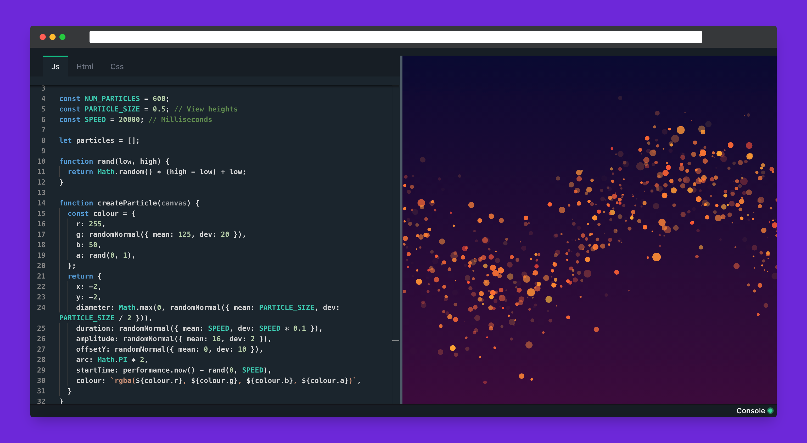

  Next-gen online editor Playground, built with <a href="https://nextjs.org/" target="_blank">Next</a> and hosted with <a href="https://vercel.com/" target="_blank">Vercel</a>

    

# Codetree

Codetree is a lightning fast ⚡️⚡️⚡️ code playground with automatic module detection as main feature. Unlike https://codepen.io/, Codetree is built on top of WebAssembly using esbuild, the code is compiled directly in your browser, without any backend and converted into machine language, allowing extremely fast execution and offline-mode.

## Usage

No need to install any npm package manually, codetree automatically detects the presence of import/require syntax in your file, downloads and installs npm package for you, for example just type `import React from "react"` for installing React library.

## Features

- Instant code compilation and preview (15x faster than codepen/codesanbox).

- Automatic import of external library.

- Auto-completion and intelliSense.

- Offline mode.